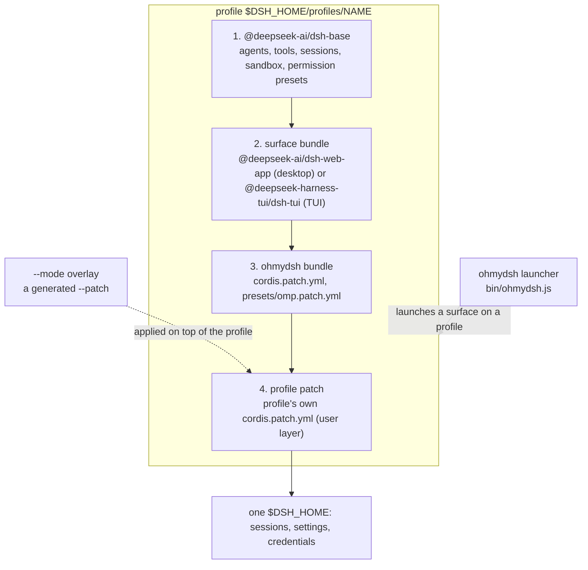

# Architecture

ohmydsh is a distribution *around* DeepSeek Harness (`dsh`). It does not
reimplement anything dsh-side: it adds one bundle (the OMP layer) and one
launcher (profiles and surfaces), and pins the upstream releases it was verified
against.

## Layers



ASCII fallback:

```
ohmydsh launcher (bin/ohmydsh.js)
  |
  |  launches a surface on a profile
  v
profile: $DSH_HOME/profiles/<name>    composed from dsh.profile.bundles, in order
  |
  |  1. @deepseek-ai/dsh-base    agents, tools, sessions, sandbox, permission presets
  |  2. surface bundle           @deepseek-ai/dsh-web-app (desktop) | @deepseek-harness-tui/dsh-tui (TUI)
  |  3. ohmydsh bundle           cordis.patch.yml, presets/omp.patch.yml  (the OMP layer)
  |  4. profile patch            $DSH_HOME/profiles/<name>/cordis.patch.yml (user layer)
  |
  |  the --mode overlay (a generated --patch) is applied on top of the profile
  v
one $DSH_HOME: sessions, settings, credentials, shared by both surfaces
```

## Composition order

Bundles compose in array order and patch files apply in list order:

1. `@deepseek-ai/dsh-base` — the backend rows: agents, tools, sessions, sandbox,
   the `permission` row (`presets` + `defaultPreset`) and the `system-prompt`
   row.
2. The surface bundle — `@deepseek-ai/dsh-web-app` for the desktop profile,
   `@deepseek-harness-tui/dsh-tui` for the TUI profile.
3. The ohmydsh bundle — the ordered `dsh.bundle.patch` list:
   `./cordis.patch.yml`, then `./presets/omp.patch.yml`.
4. The profile's own patch, `$DSH_HOME/profiles/<name>/cordis.patch.yml` — the
   user layer, initialised to an empty list and applied after all bundle
   layers.
5. The per-invocation `--patch` overlay generated for `--mode`, applied on top
   of the composed profile.

Bundle names resolve from the dsh installation first (`@deepseek-ai/dsh-base`,
`@deepseek-ai/dsh-web-app`, …), then from the profile's `node_modules`.

Inspect the result without booting: `dsh --profile <name> --dump-config` prints
`# == <layer>` markers for every composed layer and reports unmatched patch
targets on stderr; it needs no API key. A web-based profile can be initialised
without booting as well:
`dsh --profile <name> --from-default-profile web --dump-config`.

## Why the desktop surface and the TUI share one backend

- There is one `$DSH_HOME` with one directory per profile:
  `$DSH_HOME/profiles/ohmydsh-tui` and `$DSH_HOME/profiles/ohmydsh-desktop`.
- Sessions, settings and credentials are backend state, so both surfaces see the
  same data; switching surfaces does not switch you to a different session
  store.
- Both profiles compose the same ohmydsh bundle, so modes, persona and
  permission presets behave identically on both.
- The one surface-specific detail this repository records is the agent-preset
  registry row id: `agent-preset-registry` for web,
  `dsh-tui-agent-preset-registry` for the TUI plugin. The composition verifier
  checks each profile separately, so the difference stays visible.

## Bundle vs profile

- A **bundle** is an npm package that declares `dsh.bundle.patch` — a string or
  an ordered list of patch files.
- A **profile manifest** declares `dsh.profile.bundles` — the ordered array of
  bundles dsh composes for a surface.
- A package is one or the other, never both.
- `dsh plugin --profile <name> add <spec…>` initialises a missing profile with
  `@deepseek-ai/dsh-base` and appends every installed package that declares
  `dsh.bundle`.

The real bundle side, from `packages/ohmydsh/package.json`:

```jsonc
{
  "dsh": {
    "bundle": {
      "patch": [
        "./cordis.patch.yml",
        "./presets/omp.patch.yml"
      ]
    }
  }
}
```

The profile side (`$DSH_HOME/profiles/<name>/package.json`) — a bootstrapped TUI
profile, observed on the pinned dsh:

```jsonc
{
  "dsh": {
    "profile": {
      "bundles": [
        "@deepseek-ai/dsh-base",          // a missing profile is initialised with the base
        "@deepseek-harness-tui/dsh-tui",  // the surface bundle (this example: TUI)
        "ohmydsh"                         // the OMP bundle
      ]
    }
  }
}
```

The exact list follows what the profile installed: `dsh plugin --profile <name>
add <spec…>` appends every installed package that declares `dsh.bundle`. The
same shape holds for the desktop profile.

## What each layer owns

| Layer | Owns | Lives in |
|---|---|---|
| `@deepseek-ai/dsh-base` | the backend and its rows: agents, tools, sessions, sandbox, the `permission` row, the `system-prompt` row | the dsh installation |
| Surface bundle | the surface itself: `@deepseek-ai/dsh-web-app` (desktop) or `@deepseek-harness-tui/dsh-tui` (TUI) | the dsh installation (in-box) or the profile's `node_modules` |
| ohmydsh bundle (OMP layer) | persona values, `llm-deepseek.reasoningEffort`, the three OMP permission presets, the OMP agent preset (`config.id: omp`) | `packages/ohmydsh/cordis.patch.yml`, `packages/ohmydsh/presets/omp.patch.yml` |
| Profile | which bundles a surface composes, and in which order | `$DSH_HOME/profiles/<name>`, via `dsh.profile.bundles` |
| Profile patch | the profile's own user layer, applied after all bundle layers | `$DSH_HOME/profiles/<name>/cordis.patch.yml` (initialised to `[]`) |
| `--patch` overlay | the per-invocation mode selection (a generated patch) | the launcher; applied on top of the profile |

The OMP values themselves (persona, reasoning effort, presets, agent preset)
come from `packages/ohmydsh/modes.json`; how the bundle wires them in is
described in [modes.md](modes.md).
